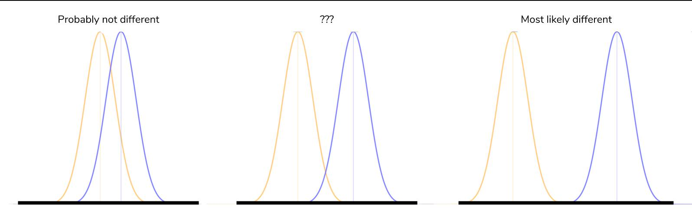
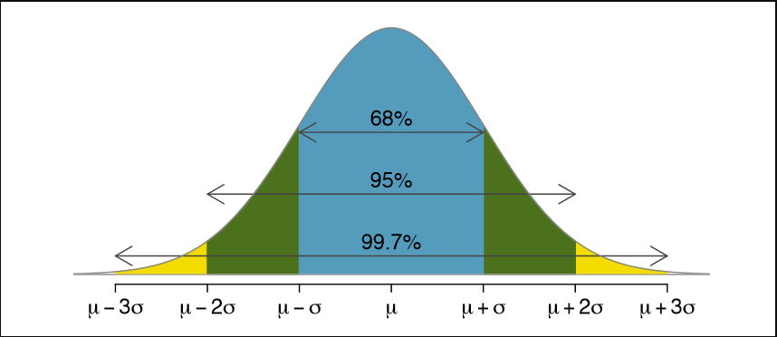

[Dunder Methods]()
## Object Initialization: init
---
Right upon starting my class I already need a special method. To construct account objects from the Account class I need a constructor which in Python is the init dunder:

    class Account:
    """A simple account class"""

    def __init__(self, owner, amount=0):
        """
        This is the constructor that lets us create
        objects from this class
        """
        self.owner = owner
        self.amount = amount
        self._transactions = []
The constructor takes care of setting up the object. In this case it receives the owner name, an optional start amount and defines an internal transactions list to keep track of deposits and withdrawals.

This allows us to create new accounts like this:

    >>> acc = Account('bob')  # default amount = 0
    >>> acc = Account('bob', 10)
## Object Representation: str, repr
---
It’s common practice in Python to provide a string representation of your object for the consumer of your class (a bit like API documentation.) There are two ways to do this using dunder methods:

**repr:** The “official” string representation of an object. This is how you would make an object of the class. The goal of repr is to be unambiguous.

**str:** The “informal” or nicely printable string representation of an object. This is for the enduser.

### Let’s implement these two methods on the Account class:

    class Account:
    # ... (see above)

    def __repr__(self):
        return 'Account({!r}, {!r})'.format(self.owner, self.amount)

    def __str__(self):
        return 'Account of {} with starting amount: {}'.format(
            self.owner, self.amount)
If you don’t want to hardcode "Account" as the name for the class you can also use self.class.name to access it programmatically.

If you wanted to implement just one of these to-string methods on a Python class, make sure it’s repr.

Now I can query the object in various ways and always get a nice string representation:

    >>> str(acc)
    'Account of bob with starting amount: 10'

    >>> print(acc)
    "Account of bob with starting amount: 10"

    >>> repr(acc)
    "Account('bob', 10)"

[Statistics - Probability](https://www.dataquest.io/blog/basic-statistics-in-python-probability/)

## What is probability?
At the most basic level, probability seeks to answer the question, “What is the chance of an event happening?” An event is some outcome of interest. To calculate the chance of an event happening, we also need to consider all the other events that can occur. The quintessential representation of probability is the humble coin toss. In a coin toss the only events that can happen are:

- Flipping a heads
- Flipping a tails

These two events form the sample space, the set of all possible events that can happen. To calculate the probability of an event occurring, we count how many times are event of interest can occur (say flipping heads) and dividing it by the sample space. Thus, probability will tell us that an ideal coin will have a 1-in-2 chance of being heads or tails. By looking at the events that can occur, probability gives us a framework for making predictions about how often events will happen. However, even though it seems obvious, if we actually try to toss some coins, we’re likely to get an abnormally high or low counts of heads every once in a while. If we don’t want to make the assumption that the coin is fair, what can we do? We can gather data! We can use statistics to calculate probabilities based on observations from the real world and check how it compares to the ideal.

    import random
    def coin_trial():
    heads = 0
    for i in range(100):
        if random.random() <= 0.5:
            heads +=1
    return heads
    def simulate(n):
        trials = []
        for i in range(n):
            trials.append(coin_trial())
    return(sum(trials)/n)
    simulate(10)
    >>> 5.4
    simulate(100)
    >>> 4.83
    simulate(1000)
    >>> 5.055
    simulate(1000000)
    >>> 4.999781

The coin_trial function is what represents a simulation of 10 coin tosses. It uses the random() function to generate a float between 0 and 1, and increments our heads count if it’s within half of that range. Then, simulate repeats these trials depending on how many times you’d like, returning the average number of heads across all of the trials. The coin toss simulations give us some interesting results.

The data and the distribution Before we can tackle the question of “which wine is better than average,” we have to mind the nature of our data. Intuitively, we’d like to use the scores of the wines to compare groups, but there comes a problem: the scores usually fall in a range. How do we compare groups of scores between types of wines and know with some degree of certainty that one is better than the other? Enter the normal distribution. The normal distribution refers to a particularly important phenomenon in the realm of probability and statistics. The normal distribution looks like this:

## Data and Distribution
- The most important qualities to notice about the normal distribution is its symmetry and its shape. We’ve been calling it a distribution, but what exactly is being distributed? It depends on the context. In probability, the normal distribution is a particular distribution of the probability across all of the events. The x-axis takes on the values of events we want to know the probability of. The y-axis is the probability associated with each event, from 0 to 1.

- We can use the curves to determine how similar they are or are they different

The central limit theorem and three sigma rule is important to determine probability of events likely to happen within a range
probability curve

Additional References:

[Students t-distribution-test](https://en.wikipedia.org/wiki/Student%27s_t-distribution)

