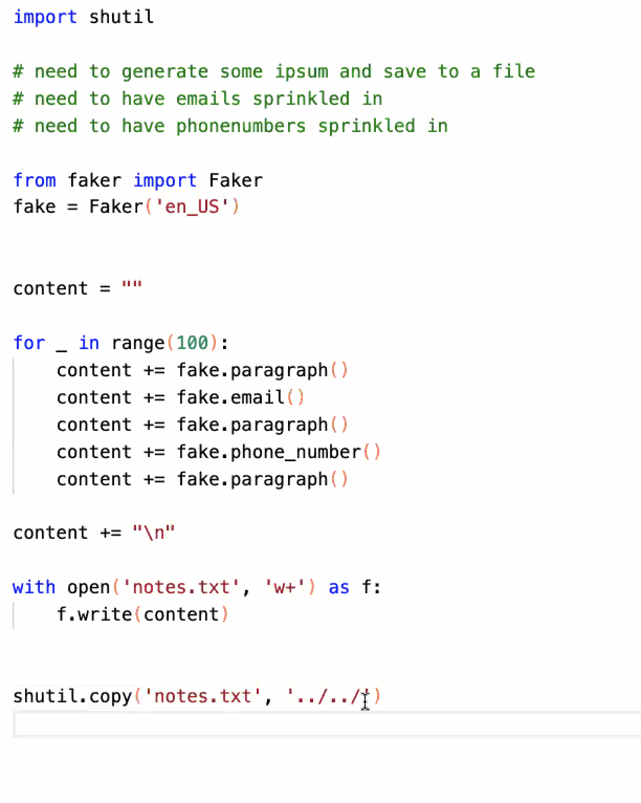

# Automation

[Regex Table](https://www.datacamp.com/community/tutorials/python-regular-expression-tutorial#table)

Regular Expressions, often shortened as regex, are a sequence of characters used to check whether a pattern exists in a given text (string) or not.

    pattern = r"Cookie"
    sequence = "Cookie"
    if re.match(pattern, sequence):
        print("Match!")
    else: print("Not a match!")

    Match!

Do you notice the r at the start of the pattern Cookie?

This is called a **raw string literal**. It changes how the string literal is interpreted. Such literals are stored as they appear.

## Python Regular Expression Tutorial

[Python Regular Expressions Tutorial](https://www.datacamp.com/community/tutorials/python-regular-expression-tutorial)

[shutil](https://pymotw.com/3/shutil/)

## Videos

[Automation Ideas](https://www.youtube.com/watch?v=qbW6FRbaSl0&t=69s)

[Automating Your Browser and Desktop Apps](https://www.youtube.com/watch?v=dZLyfbSQPXI)

## Bookmark/Skim

[Watchdog](https://pythonhosted.org/watchdog/)

- Python API library and shell utilities to monitor file system events.

- Directory monitoring made easy with A cross-platform API. A shell tool to run commands in response to directory changes. Get started quickly with a simple example in Quickstart.

